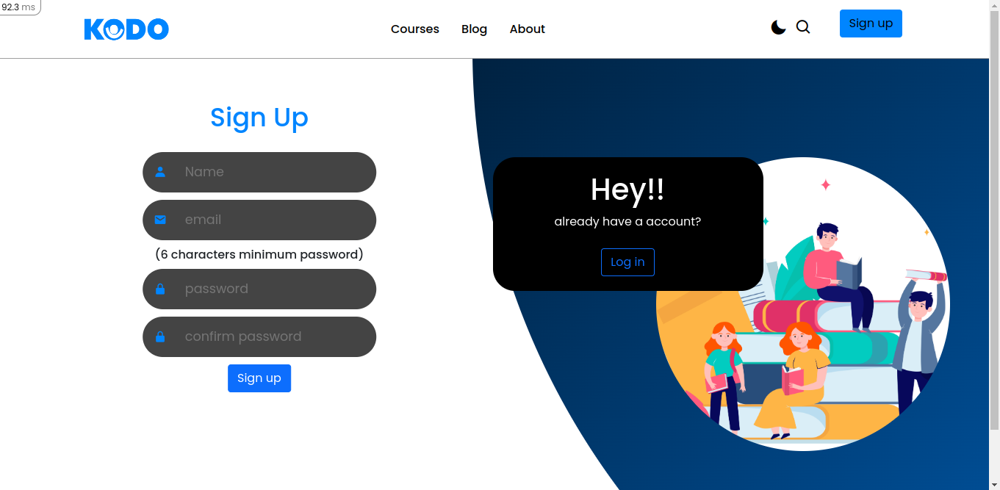

# KODO

heroku link: https://kodoselva.herokuapp.com/

sonarcloud link: https://sonarcloud.io/summary/overall?id=Selvaraj-R_Final_project

github link: https://github.com/Selvaraj-R/Final_project

# welcome to **KODO** 
 

* Kodo is a e-learning platform, where people can share and learn at the same time.

### languages used:

* Frontend - HTML5, CSS3, JS, Bootstrap-version 5.2.
* Backend - Ruby ( Version-2.6.10 )
* Framework - Rails ( Version-6.1.6 )
* Database - MySQL ( Verion-0.5 )

### color theme:

  

### figma design

## logo design 

 

## name logo

            
## Libraries used

 * ActiveStorage ( Rails v-5.2 started supporting )
  * Action text

  ## Gem used 

  * gem 'image_processing'
  * gem 'rubocop'
  * gem 'devise'

> Techinal challenged faced

1. blog with 2 more images

    if I want to write blogs i may use 2 or  more images so in order upload images i found action storage but it allows you to pick one by one so instead i tried to find anthor way and found action text which allows user to edit thier blog

 # EER diagram

  

 # Features covred 

1. Sign in 
2. login 
3. darkmode
4. search blog
5. write blog
6. edit blog
7. delete blog
8. list blog
9. save blog 
10. my blog

***

## Sign up 
   * All fields are required
   * No fields can be nil
   * Email id must be unique
   * Password must contain atleast 6      
   * Password and Confirm Password must be same 

## login 

 * All fields are required
 * Email id and password should be authenticated 

 

 ## dark mode 

 * Kodo has toe ui one will light mode and dark mode in dark mode page turns into black background 

 

 

 

 ##  Write  blog

 * input field need to be filled 
 * user can add image from local disk

   

  ## Edit blog 
   * input field need to filed or can be remained unchanged 
  
  

  ## List blog 
  * render blog data from database 
  * displayed in a order

  

  ## Delete blog 

  * blog data is delete from database 
  * user who created  it can only delete the made 

***

  ## Save blog 

  * user can save anthor persons blog into his save list 

  ## my blog 

  * blogs written by user are displayed in myblog 
   

## future plans 

 * Add course
 * chat room 
 * user management

